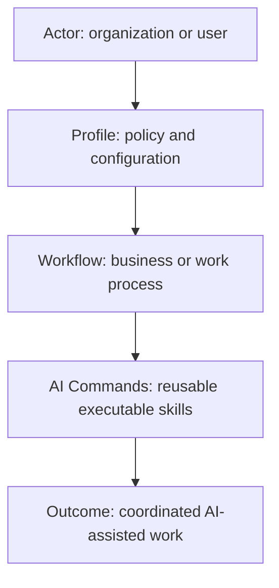
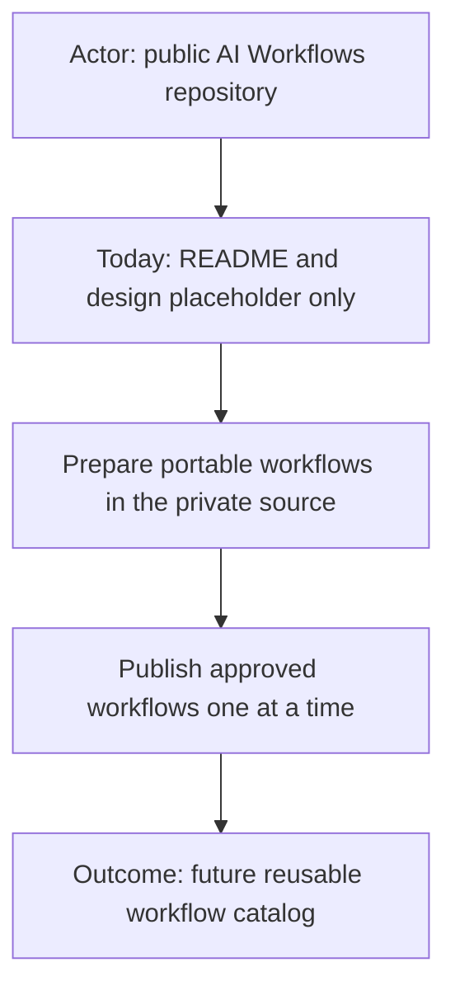
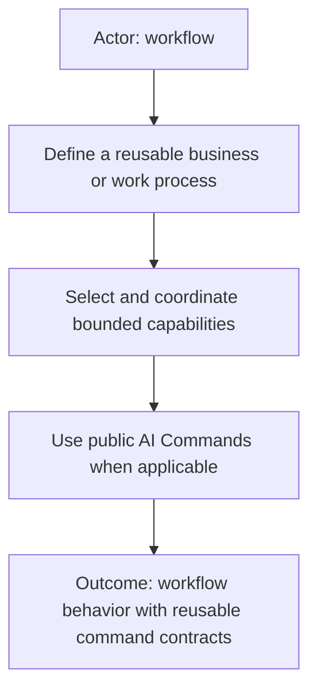
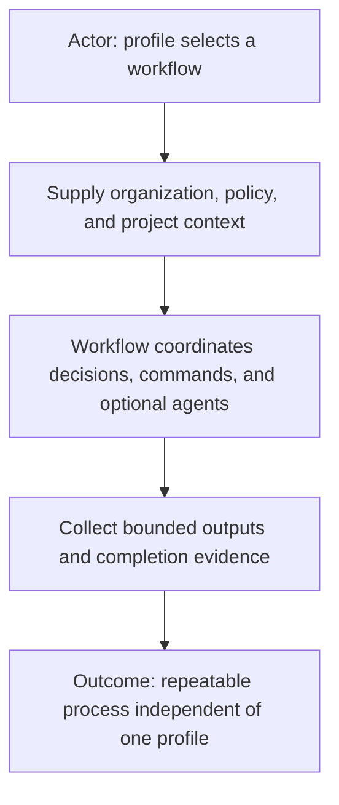
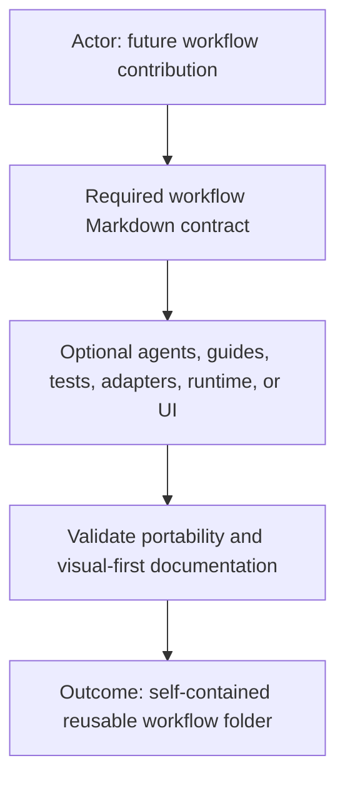
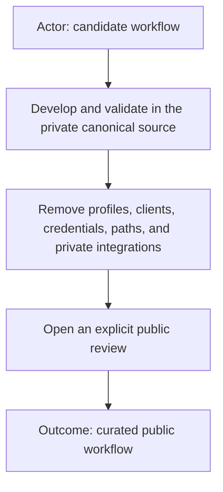

# AI Workflows

Reusable workflow definitions for coordinating AI-assisted work.

## Status: TODO

This repository is intentionally a placeholder. No workflow definitions,
profiles, agents, runtime implementation, project bindings, configuration, or
credentials are published here yet.

## Relationship to AI Commands

Workflows describe how work is coordinated. Commands describe reusable
capabilities that may be selected by a workflow. The public command catalog is
available at [AI Commands](https://github.com/starodubtsevconsulting/ai-commands).

The two repositories are intentionally separate: a command can be useful in
many workflows, and a workflow can select multiple commands without owning
their implementations.

## Workflow concept

A workflow represents a reusable business or work process. It should remain
independent of one organization, client, profile, project, AI product, runtime,
or hosting model. External context supplies the configuration and sources needed
for a particular use.

## Planned portable shape

The expected minimum is one human-readable workflow contract. Agent teams,
guides, acceptance scenarios, machine-readable manifests, adapters, executable
runtime code, and visual applications will remain optional and workflow-owned.
The final public template will be added when the first workflow is prepared for
review.

## Publication boundary

Future workflows will be published only after portability, documentation,
privacy, and security review. Until then, this README is the complete public
repository content.
