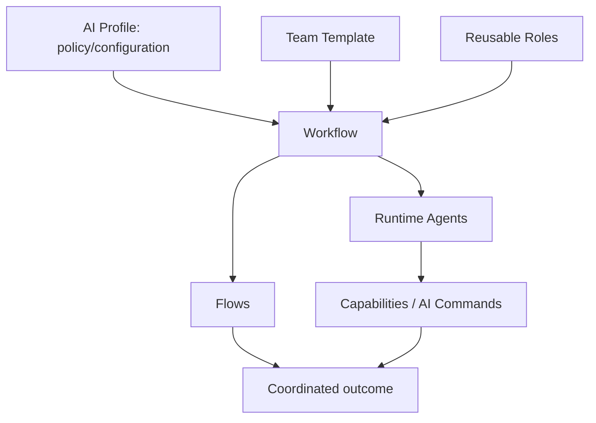
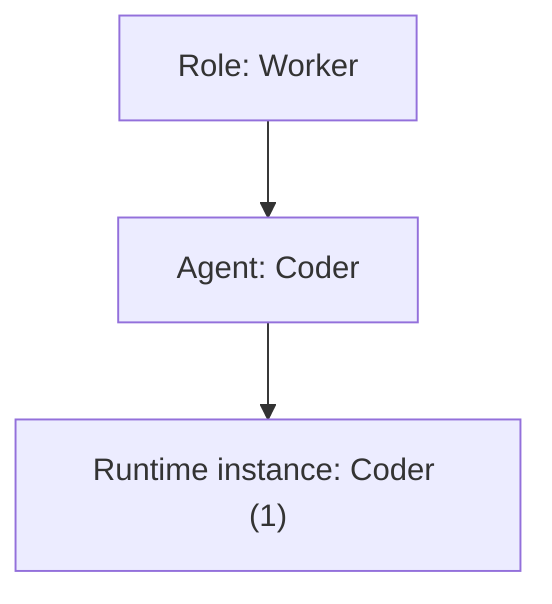
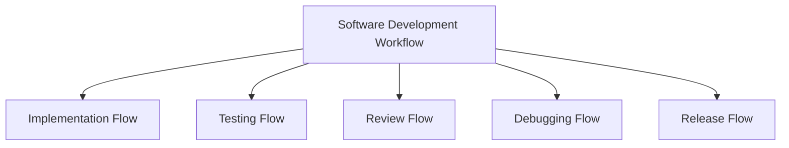
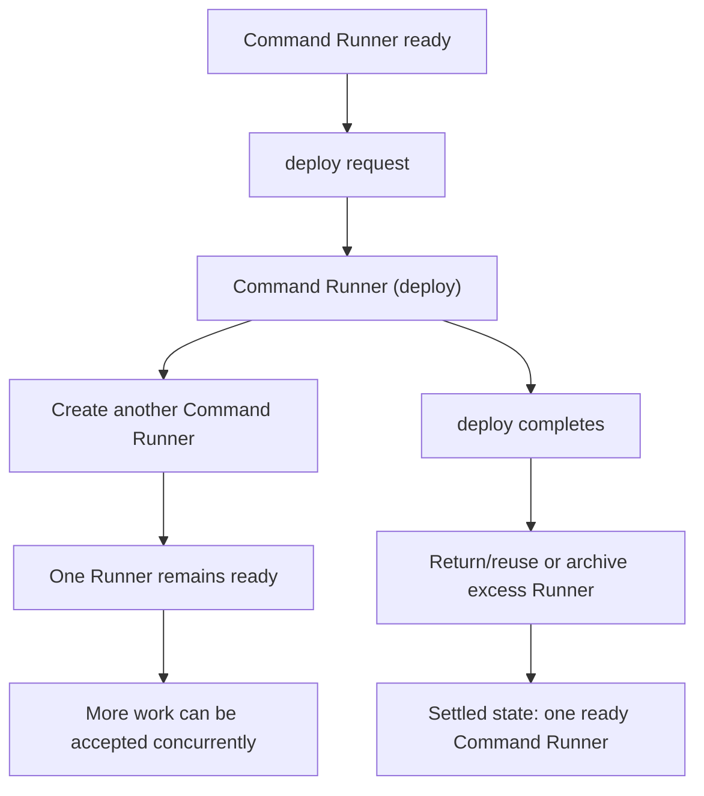

# AI Workflows

Reusable workflow definitions for coordinating AI-assisted work.

> Part of the broader [AI public collection](https://github.com/starodubtsevconsulting/ai), which provides the overview, shared vocabulary, experiments, benchmarks, and links between the published AI projects.



## Vocabulary

| Term | Meaning | Example / reference |
| --- | --- | --- |
| **Workflow** | Long-lived reusable business/work activity defining domain boundary, team, flows, sources and coordination. | Software Development |
| **Flow** | Bounded process/phase inside a workflow. | Implementation, Testing, Review, Release |
| **Role** | Reusable organizational/behavioral contract. In informal/runtime language, **agent type** may be used as a synonym. | Worker, Manager, Judge, Strategist, Admin |
| **Agent** | Concrete workflow participant fulfilling a Role, with workflow-specific name/configuration and runtime instances. | Coder fulfills Worker |
| **Agent name / identity** | Concrete name/runtime identity of an Agent. | `Coder`, `Coder (1)` |
| **Team** | Workflow-specific participants plus collaboration/security/authorization policy. | Software Development Team |
| **Team Template** | Reusable organizational/authority pattern expressed in Roles and inherited by workflows. | `standard` |
| **Runtime roster** | Current mapping of active Agents/instances to runtime identities and lifecycle state. | Coder (2) active; Coder (1) archived |
| **Elastic Agent Pool** | Runtime capacity mechanism that keeps configured ready Agent capacity and horizontally adds temporary copies when existing instances become busy. It is scaling, not cloning. | Command Runner pool with minimum ready capacity `1` |
| **Contextual knowledge / context** | Working information currently carried by an Agent's active context. Distinct from persistent memory/knowledge. | Coder's current implementation context |
| **Context transfer** | Transfer of task-relevant contextual knowledge from an outgoing Agent to its replacement before exhaustion. | Coder (1) → Coder (2) |
| **Context recovery** | Best-effort reconstruction of contextual knowledge after direct context transfer is unavailable/incomplete. | supervisor + tracker + artifacts |
| **Source / Project** | Concrete subject/context a workflow operates on. | Repository/project A |
| **[Profile](https://github.com/starodubtsevconsulting/ai-profile)** | External personal/organization configuration that activates workflows and supplies runtime/project/provider policy. | [AI Profile repository](https://github.com/starodubtsevconsulting/ai-profile) |
| **[Command](https://github.com/starodubtsevconsulting/ai-commands)** | Reusable bounded executable AI capability that Agents may invoke when authorized. | [AI Commands repository](https://github.com/starodubtsevconsulting/ai-commands) |

`Contextual knowledge` is used when clarity is useful for readers unfamiliar with LLM terminology. In shorter technical descriptions, `context` means the same working information. `Memory` remains reserved for intentionally persisted information.

## Role → Agent



A **Worker** is a reusable Role. **Coder** is a Software Development Agent fulfilling that Role.

## Standard roles

| Role | Purpose | Typical lifecycle character |
| --- | --- | --- |
| **Admin** | Human-controlled workflow administration and recovery. | Protected; outside Manager lifecycle authority. |
| **Judge** | Governance, rule integrity and compliance checking. | Managed but communication-protected. |
| **Strategist** | Workflow-local strategy and durable direction. | Managed; continuity matters. |
| **Manager** | Coordination, staffing and lifecycle management. | Managed; may self-replace. |
| **Worker** | Performs bounded domain work. | Disposable/replaceable by design. |

Software Development examples: `Worker -> Coder`, `Worker -> Designer Reviewer`, `Worker -> Command Runner`.

## Team templates

A **Team Template** packages reusable team organization and authority rules around Roles. The current [`standard` template](_common/team-templates/standard/README.md) contains common capability, communication, lifecycle and command-policy matrices.

## Workflow, Flow and Team

A workflow is the whole reusable activity. A flow is a bounded process inside it.



## Agent capacity: Elastic Agent Pool

**Elastic Agent Pool** is the reusable mechanism for horizontally scaling disposable/cheap Agents when concurrency is useful.

It is different from cloning:

`Cloning = replace an existing Agent while preserving responsibility/context lineage`

`Elastic Agent Pool = add concurrent capacity while existing Agents continue working`

The first concrete use is Command Runner. Software Development normally keeps one ready Runner:

`Command Runner`

When it accepts work, its assignment becomes visible:

`Command Runner (deploy)`

The pool then creates another ready Runner so the next caller does not wait for Agent startup:



For the current Command Runner policy:

`minimum ready capacity = 1`

Idle/ready Runner has no assignment suffix. Parentheses show active assignment, such as `(deploy)` or `(logs)`. When a reused Runner becomes idle again, the assignment suffix is removed.

Pool size, minimum ready capacity, reuse/destruction policy and maximum concurrency may later be workflow/profile/runtime configuration. The mechanism itself is generic and can be applied to another Agent when appropriate.

## Lifecycle, context transfer and cloning

Cloning is a continuity mechanism, not horizontal scaling. The preferred lifecycle is proactive cloning before context exhaustion so contextual knowledge can be transferred reliably.

With the standard two-signal policy:

`compaction/equivalent count >= configured threshold`

**AND**

`context utilization/pressure >= configured threshold`

Then the outgoing generation transfers context, enters `(cloning)`, and is replaced by exactly the next generation. Recovery cloning is used when direct context was already lost.

Normative lifecycle rules live in [`role.spec.md`](role.spec.md) and [`workflow.spec.md`](workflow.spec.md).

## Repository structure

```text
ai-workflows/
  _common/
    roles/
    team-templates/
      standard/
        README.md
        capability-matrix.csv
        communication-matrix.csv
        lifecycle-matrix.csv
        command-matrix.csv

  software-development/
    workflow.md
    agents.md
    team/
```

## Governance

Judge provides workflow-scoped governance. Scheduled monitoring is intentionally bounded sampling rather than continuous full-history review.

## Concrete workflows

### Software Development

[`software-development/workflow.md`](software-development/workflow.md) is the primary concrete workflow currently used to exercise and refine the architecture. Its concrete Agent configuration is defined in [`software-development/agents.md`](software-development/agents.md).

## Common agent/runtime contract

[`role.spec.md`](role.spec.md) defines Role-to-Agent instantiation, context-transfer and lifecycle. [`workflow.spec.md`](workflow.spec.md) defines workflow recovery sources and concrete bindings. The [Common Agent Initialization Contract](_common/initialization.md) defines authoritative roster inventory, duplicate-safe replacement batches, immutable source binding, and readiness cutover.

## Relationship to AI Commands

Workflows coordinate work. Commands describe reusable executable capabilities that workflows may select. See the [AI Commands repository](https://github.com/starodubtsevconsulting/ai-commands).

## Relationship to AI Profile

Profiles are intentionally outside this repository. See the [AI Profile repository](https://github.com/starodubtsevconsulting/ai-profile).

## Integration examples

- [Hermes-backed Proxy Agent](integrations/hermes-proxy.md)

## Publication boundary

Profiles, client bindings, credentials, private data, organization-specific configuration, local paths, and private runtime integrations are not published here.
