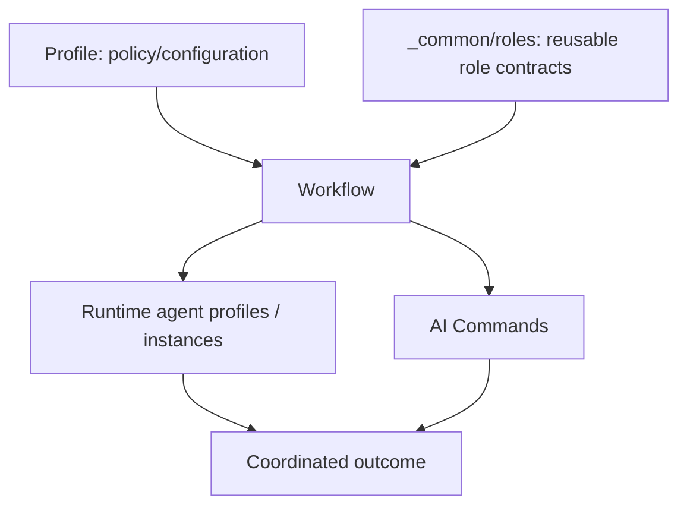

# AI Workflows

Reusable workflow definitions for coordinating AI-assisted work.



## Repository structure

Top-level non-underscore folders are concrete workflows. Shared building blocks live under `_common/` and are not workflows.

```text
ai-workflows/
  _common/
    roles/
      strategist.md
      designer.md
      coder.md
      reviewer.md
      command-runner.md

  development/
    workflow.md

  accounting/
    workflow.md
```

## Roles, workflows, and agents

A **role** is a reusable behavioral contract: responsibilities, boundaries, capabilities, lifecycle expectations, and memory requirements. Roles are defined once under [`_common/roles/`](_common/roles/).

A **workflow** is a reusable business/work process. Its `workflow.md` selects common roles, specializes them for the domain, defines their relationships and coordination, and selects reusable commands/capabilities.

An **agent** is the runtime realization of a role inside a selected workflow. Agents are not the primary source definitions in this repository.

Conceptually:

`common role + workflow specialization + profile/runtime configuration -> agent`

The workflow remains independent of a particular organization, client, project, model provider, harness, or hosting model.

## Lifecycle and memory

The common lifecycle model distinguishes persistent workflow strategy from ephemeral execution.

- **Workflow Strategist** — persistent workflow/domain continuity and durable memory across sessions.
- **Designer / Coder / Reviewer / Command Runner** — ephemeral by default; instantiated for bounded work and given compiled task-relevant context.

Persistent knowledge belongs to scoped workflow memory rather than to disposable execution-agent conversations.

A cross-workflow human-aware Governor, when present in a consuming platform/profile, sits above individual workflows. It is deliberately not defined as a workflow-local role here. Workflow Strategists optimize their domain and do not need private human context.

## Concrete workflows

### Development

[`development/workflow.md`](development/workflow.md) is the first concrete workflow. It composes Strategist, Designer, Coder, Reviewer, and Command Runner roles for software-development work.

### Accounting

[`accounting/workflow.md`](accounting/workflow.md) establishes the second workflow boundary. Its exact public role/capability composition will be expanded as portable accounting behavior is reviewed.

## Common agent/runtime contract

The existing [`agents.md`](agents.md) remains the legacy/common managed-agent contract while its identity, communication, capability, packet, evidence, and lifecycle rules are progressively refactored into the new role/workflow structure.

The existing empty CSV schemas remain fail-closed reusable contract material during this migration:

- [`role-capability-matrix.csv`](role-capability-matrix.csv)
- [`role-capability-ownership.csv`](role-capability-ownership.csv)
- [`role-communication-matrix.csv`](role-communication-matrix.csv)

Empty common schemas grant nothing. Concrete workflow capability/communication authority must be explicit.

## Relationship to AI Commands

Workflows coordinate work. Commands describe reusable executable capabilities that workflows may select. The public command catalog is available in the [AI Commands repository](https://github.com/starodubtsevconsulting/ai-commands).

A command may be reused by many workflows, and a workflow may compose many commands without owning their implementations.

## Publication boundary

Profiles, client bindings, credentials, private data, organization-specific configuration, local paths, and private runtime integrations are not published here. Concrete workflows should be published only after portability, documentation, privacy, and security review.
