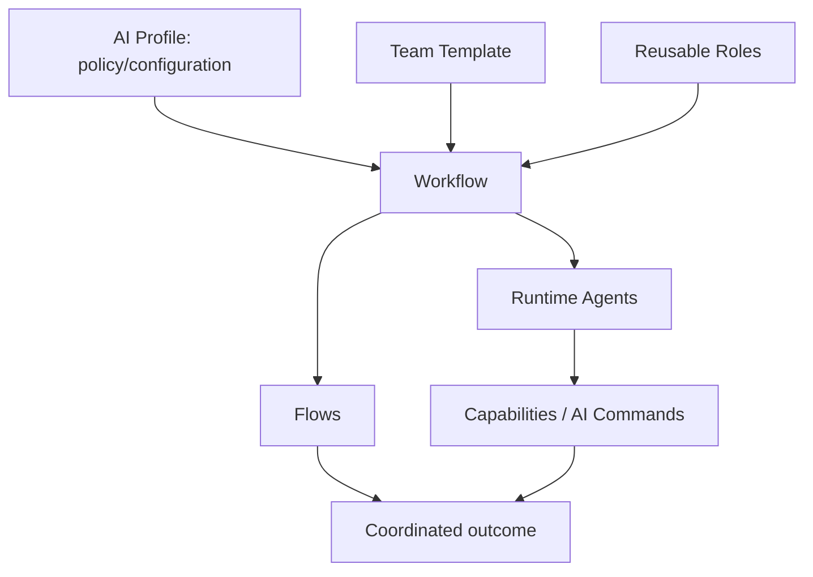
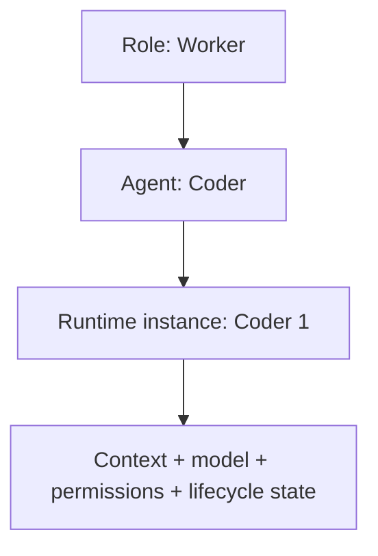
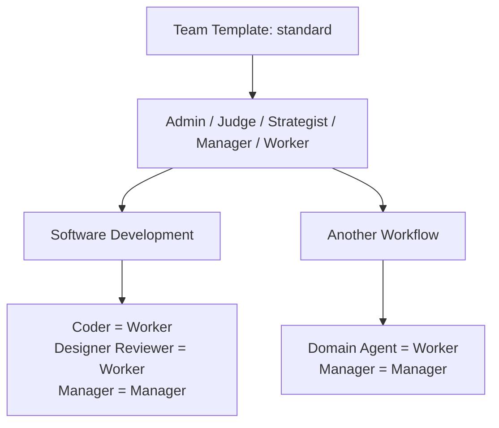
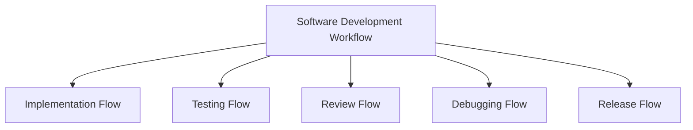

# AI Workflows

Reusable workflow definitions for coordinating AI-assisted work.

> Part of the broader [AI public collection](https://github.com/starodubtsevconsulting/ai), which provides the overview, shared vocabulary, experiments, benchmarks, and links between the published AI projects.



## Vocabulary

The repository uses a small set of terms deliberately. The distinction matters because reusable definitions, workflow configuration and running AI participants are different things.

| Term | Meaning | Example / reference |
| --- | --- | --- |
| **Workflow** | Long-lived reusable business/work activity. It defines the domain boundary, team, flows, sources and coordination. | Software Development |
| **Flow** | Bounded process/phase inside a workflow. | Implementation, Testing, Review, Release |
| **Role** | Reusable organizational/behavioral contract: responsibilities, boundaries, lifecycle semantics and general authority. In informal/runtime language, **agent type** may be used as a synonym. | Worker, Manager, Judge, Strategist, Admin |
| **Agent** | Concrete workflow participant fulfilling a Role. It has a useful workflow-specific name/configuration and may have changing runtime instances. | Coder fulfills Worker |
| **Agent name / identity** | Concrete name/runtime identity of an Agent. | `Coder`, `Coder 1`, `Frontend Coder` |
| **Team** | Workflow-specific set of participants plus collaboration/security/authorization policy. | Software Development Team |
| **Team Template** | Reusable organizational/authority pattern expressed in Roles and inherited by workflows. | `standard` |
| **Runtime roster** | Current mapping of active team Agents/instances to runtime identities and lifecycle state. | Coder 1 active; Coder 0 archived |
| **Source / Project** | Concrete subject/context a workflow operates on. Project is a common Software Development source type. | Repository/project A |
| **[Profile](https://github.com/starodubtsevconsulting/ai-profile)** | External personal/organization configuration that activates workflows and supplies concrete runtime/project/provider policy. Profile belongs to the separate AI Profile project, not this repository. | [AI Profile repository](https://github.com/starodubtsevconsulting/ai-profile) |
| **[Command](https://github.com/starodubtsevconsulting/ai-commands)** | Reusable bounded executable AI capability that Agents may invoke when workflow/team policy authorizes it. Commands are defined outside this repository and can be shared by many workflows. | [AI Commands repository](https://github.com/starodubtsevconsulting/ai-commands) |

### Role → Agent

This is one of the central distinctions:



A **Worker** is a reusable Role. **Coder** is a Software Development Agent fulfilling that Role. `Coder 1` may be the current runtime identity/instance of that Agent.

The same pattern applies to other participants:

`Judge role -> Judge agent`

`Manager role -> Manager agent`

The Role and Agent may happen to use the same display name; they are still different architectural layers.

## Standard roles

The current standard team organization uses five Roles:

| Role | Purpose | Typical lifecycle character |
| --- | --- | --- |
| **Admin** | Human-controlled workflow administration and recovery. | Protected; outside Manager lifecycle authority. |
| **Judge** | Governance, rule integrity and compliance checking. | Managed but communication-protected. |
| **Strategist** | Workflow-local strategy and durable direction. | Managed; continuity matters. |
| **Manager** | Coordination, staffing and lifecycle management. | Managed; may self-replace. |
| **Worker** | Performs bounded domain work. | Disposable/replaceable by design. |

Concrete workflow Agents fulfill these Roles. For Software Development, for example:

`Worker -> Coder`

`Worker -> Designer Reviewer`

`Worker -> Command Runner`

`Worker -> UI Acceptance Tester`

The Role list is intentionally small. A new Role should be introduced only when an Agent genuinely requires organizational/lifecycle semantics that do not fit an existing Role.

## Team templates

A workflow should not copy nearly identical matrices merely because it has differently named workers.

A **Team Template** packages reusable team organization and authority rules around Roles. The current [`standard` template](_common/team-templates/standard/README.md) contains the default lifecycle policy for Admin, Judge, Strategist, Manager and Worker.



A concrete workflow selects a template, assigns Roles to its concrete Agents, and declares only genuine exceptions/overrides. If a future workflow needs a fundamentally different organization, another named Team Template can be introduced rather than duplicating or weakening the standard one.

## Workflow, Flow and Team

A workflow is the whole reusable activity. A flow is a bounded process inside it; it is not a synonym for route.

For example:



The workflow owns the team. Individual flows coordinate whichever subset of that team is needed for that bounded process. An Agent may therefore participate in multiple flows.

## Repository structure

Top-level non-underscore folders are concrete workflows. Shared building blocks live under `_common/` and are not workflows.

```text
ai-workflows/
  _common/
    roles/
      ... reusable role contracts ...
    team-templates/
      standard/
        README.md
        lifecycle-matrix.csv

  software-development/
    workflow.md
    agents.md
    team/
      ... workflow bindings and overrides ...
```

## Roles, workflows, and agents

A **Role** is a reusable organizational/behavioral contract. Roles are defined under [`_common/roles/`](_common/roles/) and/or supplied by a Team Template.

A **Workflow** is a reusable business/work process. Its `workflow.md` defines flows and domain coordination and configures the Agents that fulfill the selected Roles.

An **Agent** is a concrete workflow participant fulfilling one Role. Agents are configured for their domain job and instantiated by the runtime.

Conceptually:

`Role -> workflow Agent -> runtime instance/identity`

The workflow remains independent of a particular organization, client, project, model provider, harness, or hosting model.

## Lifecycle and cloning

Agents are replaceable runtime instances. Roles and responsibilities survive individual runtime instances.

Every Agent must satisfy the common instantiation contract from [`role.spec.md`](role.spec.md), including clone policy. Context-health signals are harness-neutral: compaction/equivalent count is preferred when available, with context utilization/pressure as fallback.

The common clone lifecycle is:

`ACTIVE -> handoff -> (cloning) LOCKED -> ARCHIVED`

while a validated replacement receives the responsibility and becomes active. The full vertical lifecycle diagram and normative rules live in [`role.spec.md`](role.spec.md).

Lifecycle/control authorization is distinct from ordinary agent communication. For example, a Manager may be allowed to send Judge an authorized clone signal while remaining forbidden from ordinary conversation with Judge.

## Governance

Judge provides workflow-scoped governance. Its cheap scheduled monitoring is intentionally bounded sampling rather than continuous full-history review. Human may explicitly request deeper historical audits when additional assurance is worth the context/token cost.

Judge also provides narrow lifecycle governance gates such as candidate-agent initialization validation. These control-plane interactions do not create general conversational permission between agents and Judge.

## Concrete workflows

### Software Development

[`software-development/workflow.md`](software-development/workflow.md) is the primary concrete workflow currently used to exercise and refine the architecture. Its concrete Agent configuration is defined in [`software-development/agents.md`](software-development/agents.md).

## Common agent/runtime contract

[`role.spec.md`](role.spec.md) defines the common Role-to-Agent instantiation and lifecycle contract. [`workflow.spec.md`](workflow.spec.md) defines how workflows supply concrete bindings while avoiding duplication of role-level normative rules.

Common Team Templates provide reusable organizational/authority policy. Workflow-local matrices should represent bindings and genuine overrides rather than copies of common policy.

## Relationship to AI Commands

Workflows coordinate work. Commands describe reusable executable capabilities that workflows may select. The public command catalog is available in the [AI Commands repository](https://github.com/starodubtsevconsulting/ai-commands).

A command may be reused by many workflows, and a workflow may compose many commands without owning their implementations.

## Relationship to AI Profile

Profiles are intentionally outside this repository. The separate [AI Profile repository](https://github.com/starodubtsevconsulting/ai-profile) shows how personal/organization-specific configuration can activate workflows, bind projects and supply runtime/provider policy without making those concerns part of reusable workflow definitions.

## Publication boundary

Profiles, client bindings, credentials, private data, organization-specific configuration, local paths, and private runtime integrations are not published here. Concrete workflows should be published only after portability, documentation, privacy, and security review.
