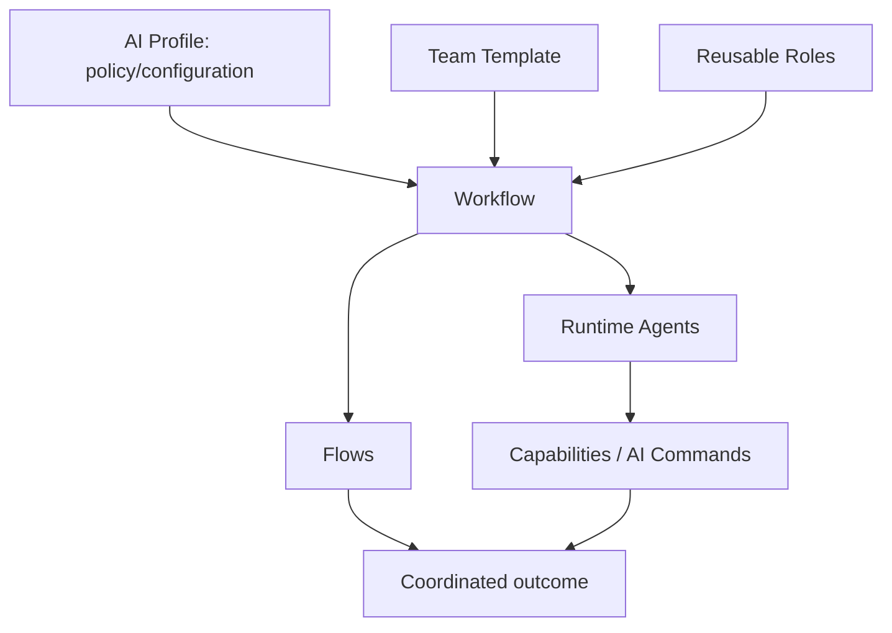
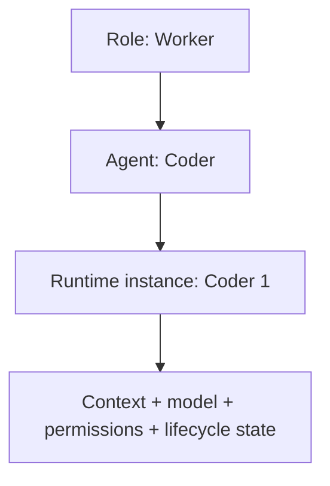
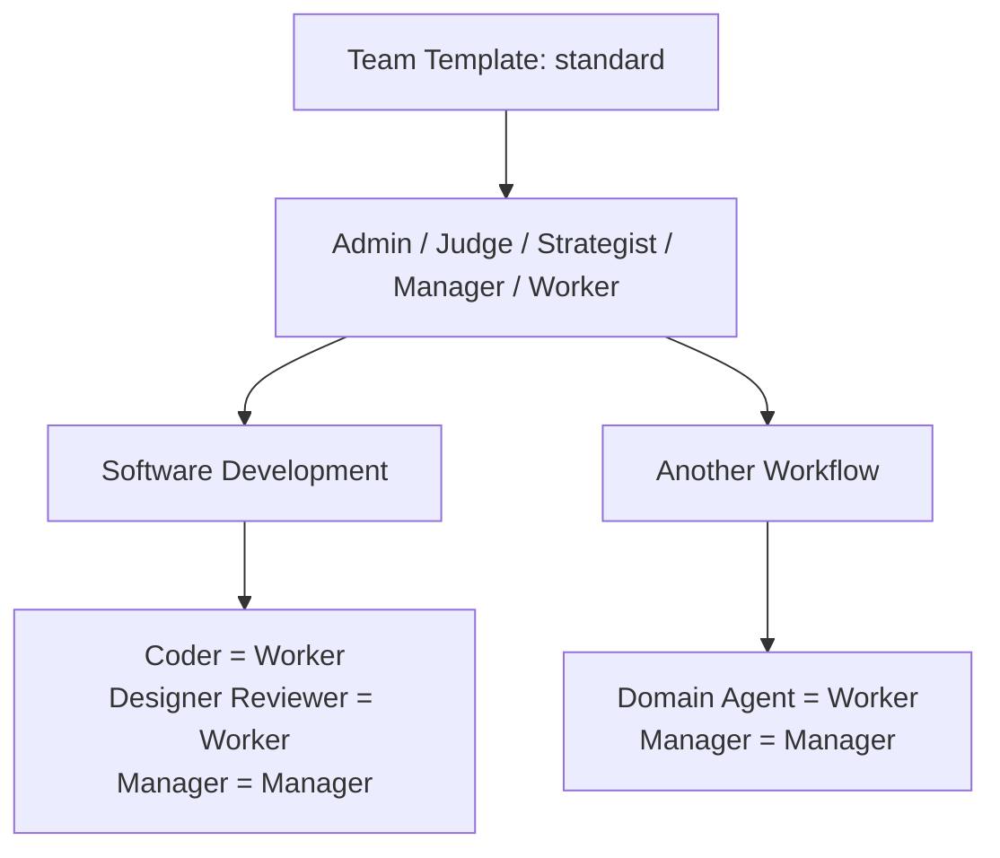
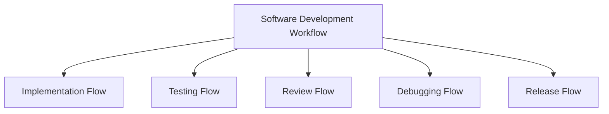
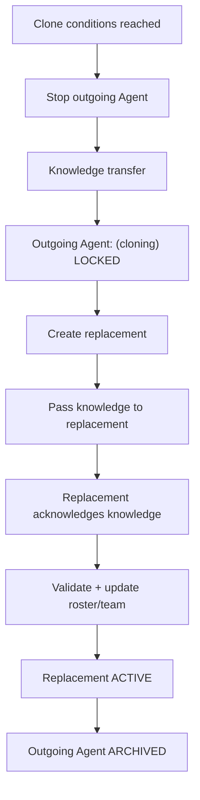

# AI Workflows

Reusable workflow definitions for coordinating AI-assisted work.

> Part of the broader [AI public collection](https://github.com/starodubtsevconsulting/ai), which provides the overview, shared vocabulary, experiments, benchmarks, and links between the published AI projects.



## Vocabulary

| Term | Meaning | Example / reference |
| --- | --- | --- |
| **Workflow** | Long-lived reusable business/work activity defining domain boundary, team, flows, sources and coordination. | Software Development |
| **Flow** | Bounded process/phase inside a workflow. | Implementation, Testing, Review, Release |
| **Role** | Reusable organizational/behavioral contract. In informal/runtime language, **agent type** may be used as a synonym. | Worker, Manager, Judge, Strategist, Admin |
| **Agent** | Concrete workflow participant fulfilling a Role, with workflow-specific name/configuration and runtime instances. | Coder fulfills Worker |
| **Agent name / identity** | Concrete name/runtime identity of an Agent. | `Coder`, `Coder 1` |
| **Team** | Workflow-specific participants plus collaboration/security/authorization policy. | Software Development Team |
| **Team Template** | Reusable organizational/authority pattern expressed in Roles and inherited by workflows. | `standard` |
| **Runtime roster** | Current mapping of active Agents/instances to runtime identities and lifecycle state. | Coder 1 active; Coder 0 archived |
| **Knowledge transfer** | Deliberate transfer of task-relevant working knowledge from an outgoing Agent to its replacement before that knowledge is lost to context exhaustion. | decisions, current state, blockers, next action |
| **Source / Project** | Concrete subject/context a workflow operates on. Project is a common Software Development source type. | Repository/project A |
| **[Profile](https://github.com/starodubtsevconsulting/ai-profile)** | External personal/organization configuration that activates workflows and supplies runtime/project/provider policy. | [AI Profile repository](https://github.com/starodubtsevconsulting/ai-profile) |
| **[Command](https://github.com/starodubtsevconsulting/ai-commands)** | Reusable bounded executable AI capability that Agents may invoke when authorized. | [AI Commands repository](https://github.com/starodubtsevconsulting/ai-commands) |

### Role → Agent



A **Worker** is a reusable Role. **Coder** is a Software Development Agent fulfilling that Role. `Coder 1` may be the current runtime identity/instance of that Agent.

## Standard roles

| Role | Purpose | Typical lifecycle character |
| --- | --- | --- |
| **Admin** | Human-controlled workflow administration and recovery. | Protected; outside Manager lifecycle authority. |
| **Judge** | Governance, rule integrity and compliance checking. | Managed but communication-protected. |
| **Strategist** | Workflow-local strategy and durable direction. | Managed; continuity matters. |
| **Manager** | Coordination, staffing and lifecycle management. | Managed; may self-replace. |
| **Worker** | Performs bounded domain work. | Disposable/replaceable by design. |

Software Development examples:

`Worker -> Coder`

`Worker -> Designer Reviewer`

`Worker -> Command Runner`

`Worker -> UI Acceptance Tester`

## Team templates

A **Team Template** packages reusable team organization and authority rules around Roles. The current [`standard` template](_common/team-templates/standard/README.md) contains common capability, communication, lifecycle and command-policy matrices.



A concrete workflow selects a template, assigns Roles to concrete Agents, and declares only genuine exceptions/overrides.

## Workflow, Flow and Team

A workflow is the whole reusable activity. A flow is a bounded process inside it.



The workflow owns the team. Individual flows coordinate whichever subset of that team is needed. An Agent may participate in multiple flows.

## Lifecycle, knowledge transfer and cloning

Agents are replaceable runtime instances. Roles and responsibilities survive individual runtime instances.

The preferred lifecycle is **proactive cloning**. The goal is not merely to replace an exhausted Agent; it is to replace the Agent **before exhaustion so its working knowledge can be transferred reliably**.

With the standard two-signal clone policy, proactive replacement starts when both configured conditions are true:

`compaction/equivalent count >= configured threshold`

**AND**

`context utilization/pressure >= configured threshold`

Then:



Knowledge transfer normally includes the current objective, decisions, completed work, current state, evidence, blockers, assumptions and next action. It is intentionally task-relevant rather than a raw transcript dump.

If proactive cloning is missed and the old Agent has already exhausted/lost its useful context, the system enters **recovery cloning**. The replacement can still be created, but normal knowledge transfer can no longer be trusted. Context must instead be reconstructed from whatever external evidence remains. This is a degraded/emergency path with weaker continuity guarantees.

The normative lifecycle, recovery behavior and detailed vertical diagram live in [`role.spec.md`](role.spec.md).

Lifecycle/control authorization is distinct from ordinary Agent communication. For example, a Manager may be allowed to send Judge an authorized clone signal while remaining forbidden from ordinary conversation with Judge.

## Repository structure

```text
ai-workflows/
  _common/
    roles/
    team-templates/
      standard/
        README.md
        capability-matrix.csv
        communication-matrix.csv
        lifecycle-matrix.csv
        command-matrix.csv

  software-development/
    workflow.md
    agents.md
    team/
      ... workflow bindings and overrides ...
```

## Governance

Judge provides workflow-scoped governance. Its cheap scheduled monitoring is intentionally bounded sampling rather than continuous full-history review. Human may explicitly request deeper historical audits when additional assurance is worth the context/token cost.

Judge also provides narrow lifecycle governance gates such as candidate-Agent initialization validation. These control-plane interactions do not create general conversational permission between Agents and Judge.

## Concrete workflows

### Software Development

[`software-development/workflow.md`](software-development/workflow.md) is the primary concrete workflow currently used to exercise and refine the architecture. Its concrete Agent configuration is defined in [`software-development/agents.md`](software-development/agents.md).

## Common agent/runtime contract

[`role.spec.md`](role.spec.md) defines the common Role-to-Agent instantiation, knowledge-transfer and lifecycle contract. [`workflow.spec.md`](workflow.spec.md) defines how workflows supply concrete bindings while avoiding duplication of role-level normative rules.

## Relationship to AI Commands

Workflows coordinate work. Commands describe reusable executable capabilities that workflows may select. The public command catalog is available in the [AI Commands repository](https://github.com/starodubtsevconsulting/ai-commands).

## Relationship to AI Profile

Profiles are intentionally outside this repository. The separate [AI Profile repository](https://github.com/starodubtsevconsulting/ai-profile) shows how personal/organization-specific configuration can activate workflows, bind projects and supply runtime/provider policy.

## Publication boundary

Profiles, client bindings, credentials, private data, organization-specific configuration, local paths, and private runtime integrations are not published here.