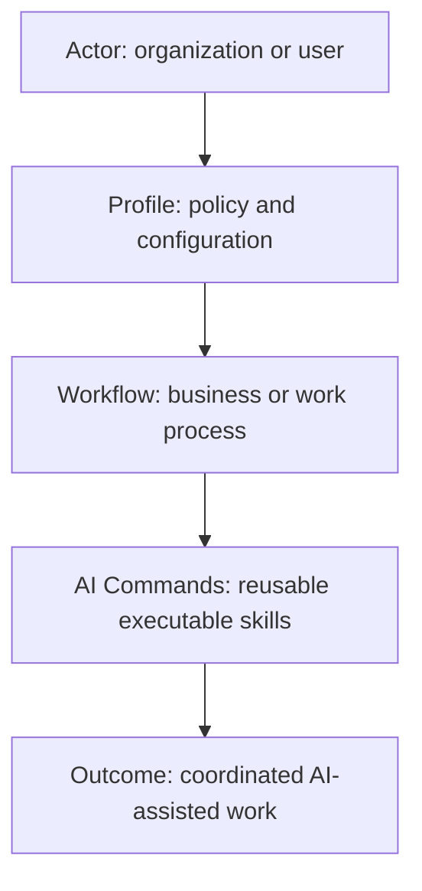
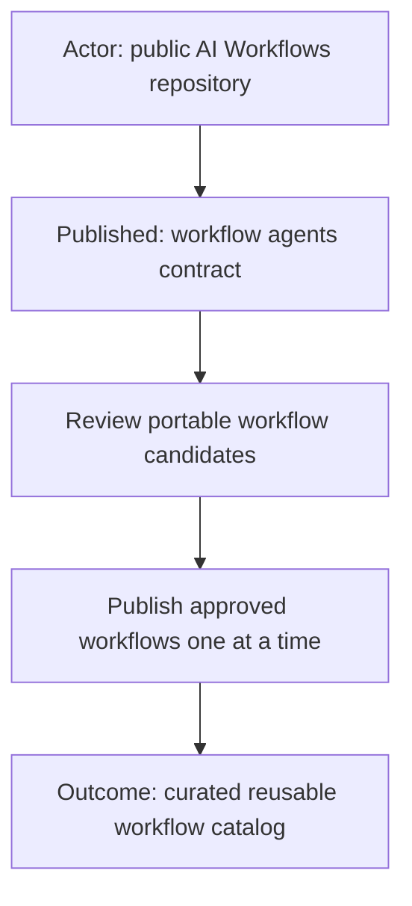
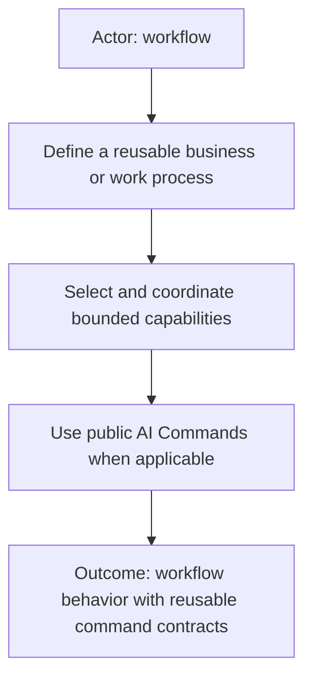
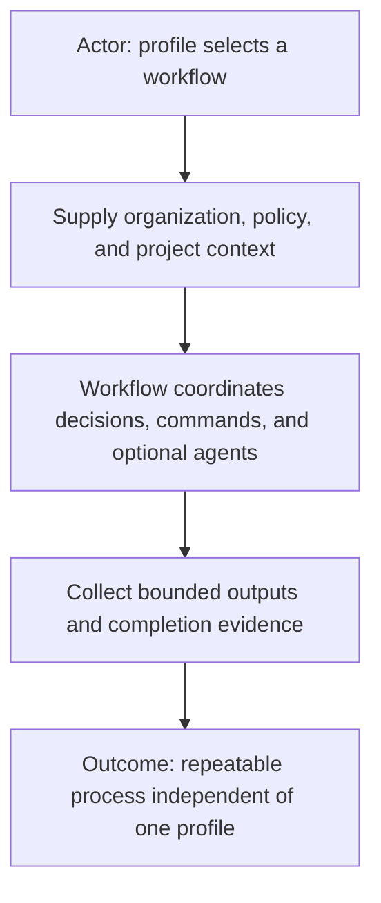
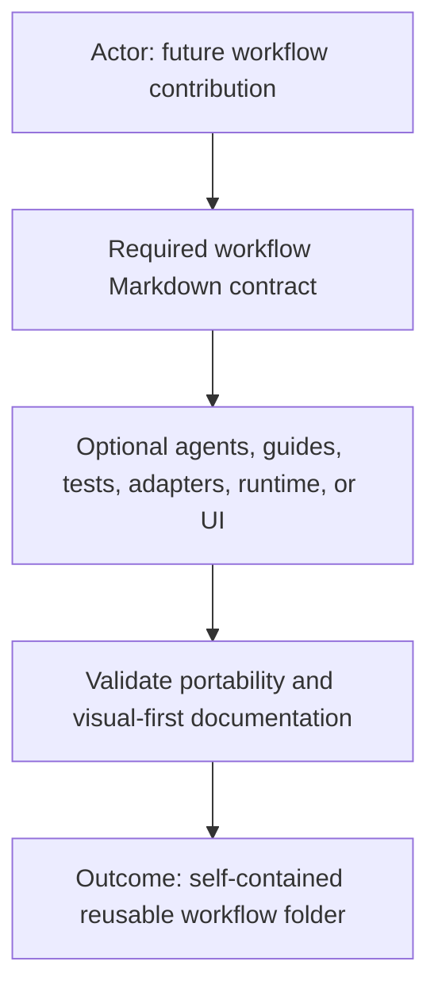
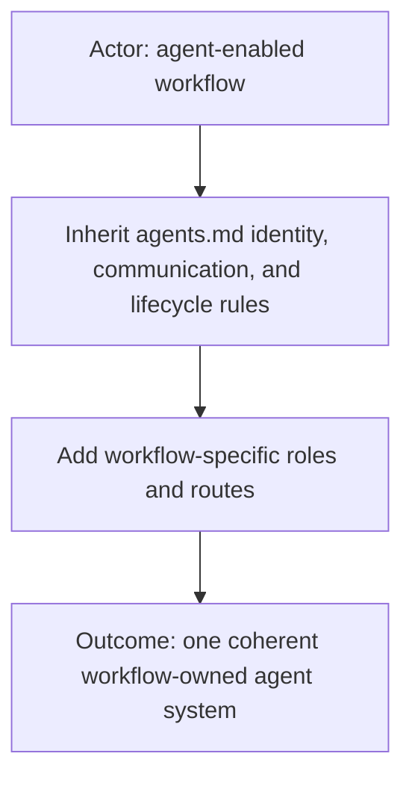
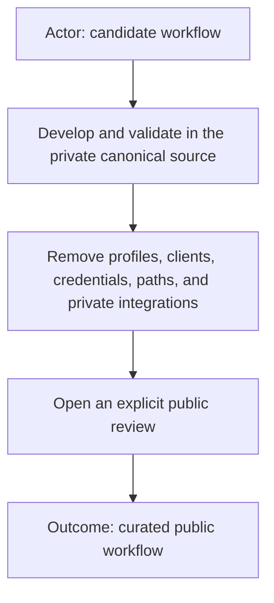

# AI Workflows



Reusable workflow definitions for coordinating AI-assisted work.

## Published contracts



The repository currently publishes [`agents.md`](agents.md), the single common
contract for workflows that activate managed agents. It combines identity,
communication, capability boundaries, Admin, Judge, and lifecycle rules.
Concrete workflow definitions will be added separately after portability and
privacy review. Profiles, client bindings, credentials, and private runtime
configuration are not published here.

## Relationship to AI Commands



Workflows describe how work is coordinated. Commands describe reusable
capabilities that may be selected by a workflow. The public command catalog is
available at [AI Commands](https://github.com/starodubtsevconsulting/ai-commands).

The two repositories are intentionally separate: a command can be useful in
many workflows, and a workflow can select multiple commands without owning
their implementations.

## Workflow concept



A workflow represents a reusable business or work process. It should remain
independent of one organization, client, profile, project, AI product, runtime,
or hosting model. External context supplies the configuration and sources needed
for a particular use.

## Planned portable shape



The expected minimum is one human-readable workflow contract. Agent teams,
guides, acceptance scenarios, machine-readable manifests, adapters, executable
runtime code, and visual applications will remain optional and workflow-owned.
The final public template will be added when the first workflow is prepared for
review.

## Workflow agents



Agent-enabled workflows inherit [`agents.md`](agents.md). It is workflow
infrastructure rather than an AI command or standalone agent. Each concrete
workflow adds its own roles, models, capabilities, routes, and stricter rules
without duplicating the common contract.

### Role and capability matrices

The common package includes three empty CSV schemas:

- [`role-capability-matrix.csv`](role-capability-matrix.csv) defines the roles a workflow initializes and their runtime
  identity, model, lifecycle, human-facing mode, and communication mode.
- [`role-capability-ownership.csv`](role-capability-ownership.csv) defines what each role owns, may dispatch, may read,
  or must never perform.
- [`role-communication-matrix.csv`](role-communication-matrix.csv) defines human dialogue, internal packet, authorization
  relay, and role-to-role communication routes.

Empty common schemas grant nothing. An agent-enabled workflow copies and fills all three files in its own `agents/` folder.
Every role contract then places a readable `Capability declaration` near its top and links to those workflow-local
matrices. The readable table summarizes the boundary; the filled CSVs are the mechanical authority.

A simplified role matrix can look like this:

```csv
role,display_label,model,reasoning,lifecycle,human_facing,communication_mode
designer / reviewer,Designer / Reviewer,configured-model,low,persistent control,primary,human dialogue and agent packets
coder,Coder,configured-model,medium,disposable worker,not human-facing,internal packets only
command-runner,Command Runner,configured-model,low,disposable worker,not human-facing,internal packets only
```

The matching ownership matrix can look like this:

```csv
capability,designer_reviewer,coder,command_runner
Product requirements and architecture,OWN,READ_DETAIL,PROHIBITED
Product source and tests,PROHIBITED,OWN,PROHIBITED
Registered command execution,DISPATCH_ONLY,DISPATCH_ONLY,OWN
```

The matching communication matrix can look like this:

```csv
route,designer_reviewer,coder,command_runner
direct_human_dialogue,PRIMARY,PROHIBITED,PROHIBITED
send_internal_work_packet,AUTHORIZED,PROHIBITED,RETURN_ONLY
use_human_as_packet_courier,PROHIBITED,PROHIBITED,PROHIBITED
```

`OWN` remains bounded by the role contract, `DISPATCH_ONLY` permits routing to the exact owner, `READ_DETAIL` is
passive, and `PROHIBITED` is a hard boundary. A missing role, empty workflow-local matrix, broken declaration link, or
declaration/matrix disagreement fails closed. Later prose may explain mechanics or narrow a permission, but it cannot
create a route or capability absent from these matrices.

## Publication boundary



Additional workflows will be published only after portability, documentation,
privacy, and security review. The workflow-agent contract is reusable
infrastructure and does not publish any private profile or concrete workflow.
