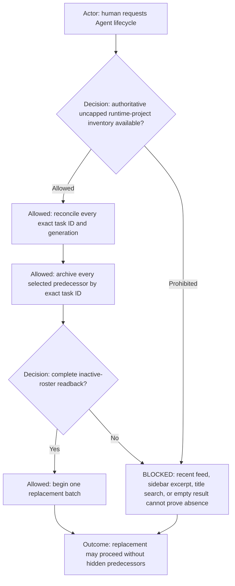
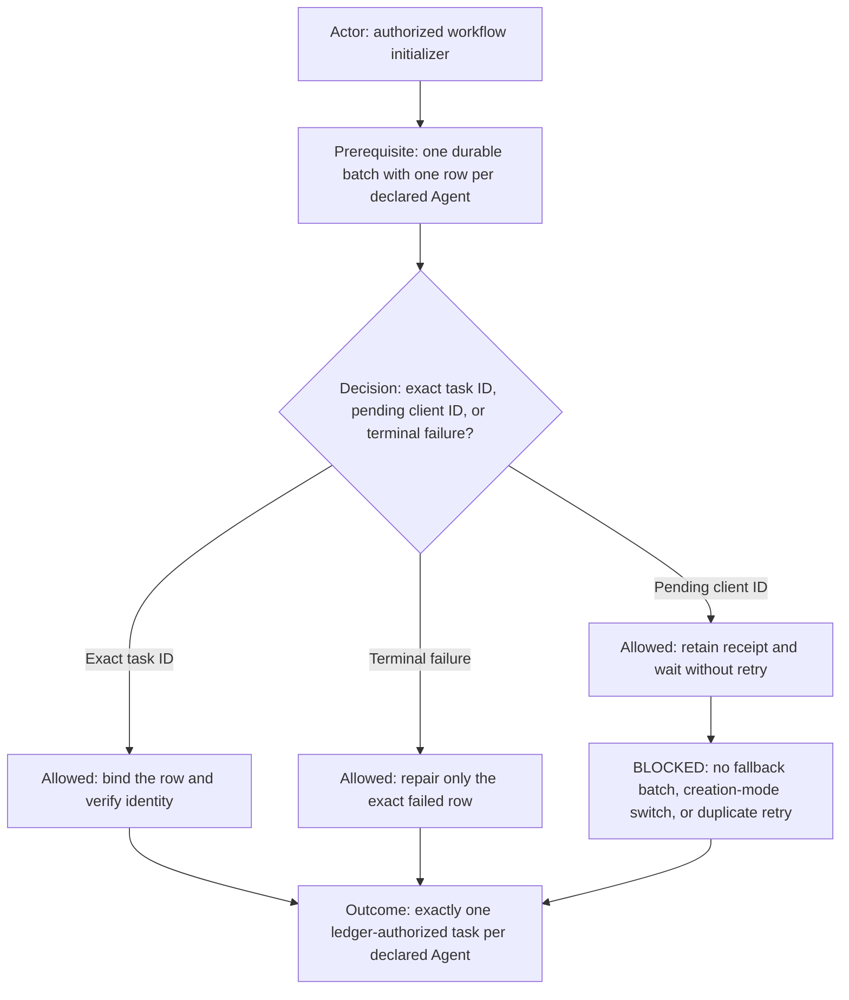
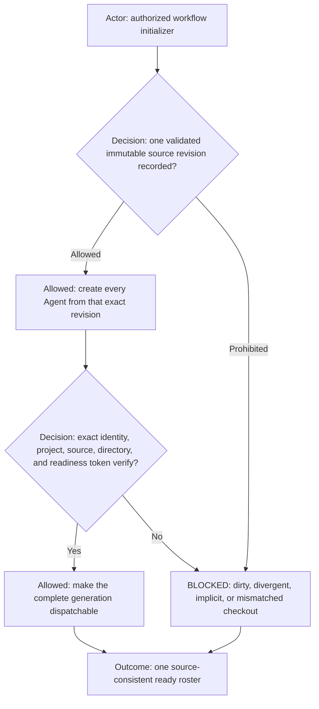

# Common Agent Initialization Contract

## Included rules

| Included rule | Required application |
| --- | --- |
| [Included Rules Principle](https://github.com/starodubtsevconsulting/ai-commands/blob/main/doc/principles/included-rules-principle.md) | Load external rule dependencies explicitly and transitively. |
| [Diagram First Principle](https://github.com/starodubtsevconsulting/ai-commands/blob/main/doc/principles/diagram-first-principle.md) | Keep lifecycle decisions and blocked routes aligned with the diagrams below. |

## Authoritative inventory and archive barrier

- Before any archive or create call, enumerate the complete selected runtime project through an authoritative, uncapped
  membership source that returns exact task IDs and archived state.
- A recent-task feed, capped listing, sidebar excerpt, title search, conversation memory, or empty result from those
  surfaces is never evidence that an Agent is absent. If complete inventory is unavailable, return
  `BLOCKED_AUTHORITATIVE_ROSTER_INVENTORY_UNAVAILABLE` with zero lifecycle mutation.
- Archive selected predecessors concurrently by exact ID and verify the complete inactive barrier before creating any
  successor. Duplicate active generations are reconciled before creation.

## Durable creation ledger

- A receipt containing only `clientThreadId` is pending, not absent or failed. Retain its intended Agent identity until it
  resolves to an exact task ID or terminal failure.
- While any receipt is pending, do not retry that Agent, launch a fallback batch, switch creation modes, or infer absence
  from a bounded listing. Return `WAIT_FOR_PENDING_CREATION_RECEIPTS`.
- If a delayed candidate appears beside another candidate, archive the non-authoritative generation by exact ID before
  completion. Final cutover requires one active task per non-elastic Agent, only ledger-authorized elastic capacity, no
  unresolved client IDs, and no task from an earlier attempt.

## Immutable source revision and readiness

- Record one immutable revision containing the validated profile binding, manifest, Team policy, role contracts, and all
  included rules. Every created worktree starts from that exact revision.
- A dirty or divergent checkout HEAD, implicit default branch, or mismatched worktree revision is
  `BLOCKED_INITIALIZATION_SOURCE_REVISION`. Archive the candidate by exact ID; never bind it.
- Bind the complete exact task-ID directory after all rows resolve. Readiness is all-or-nothing and requires every exact
  role acknowledgement before the new generation becomes dispatchable.

