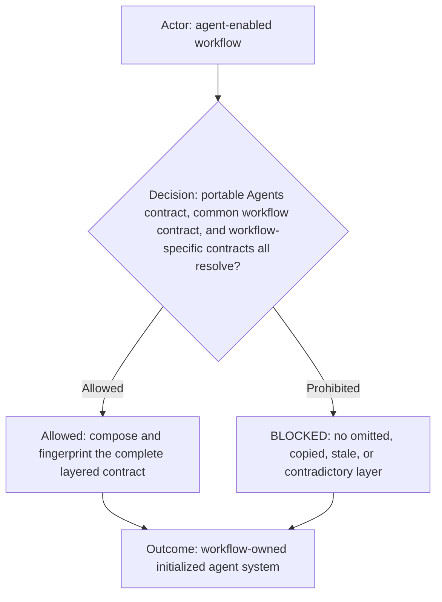
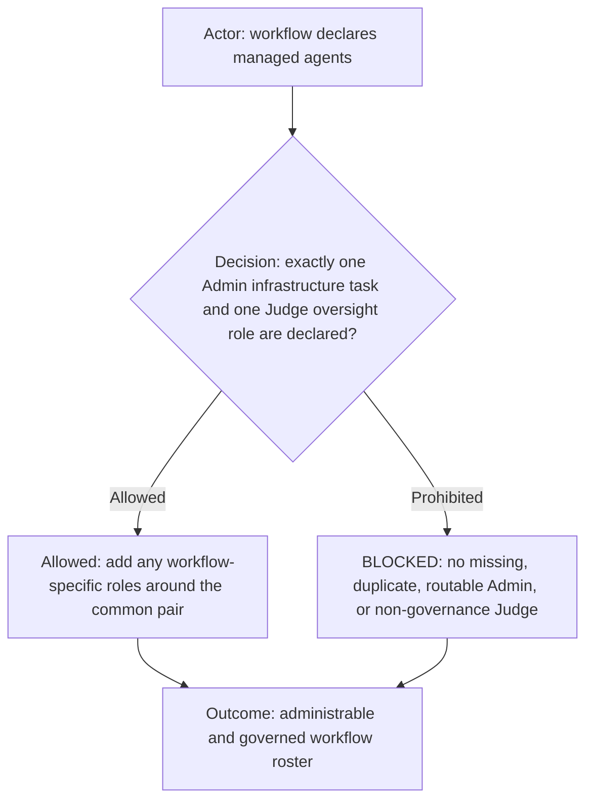
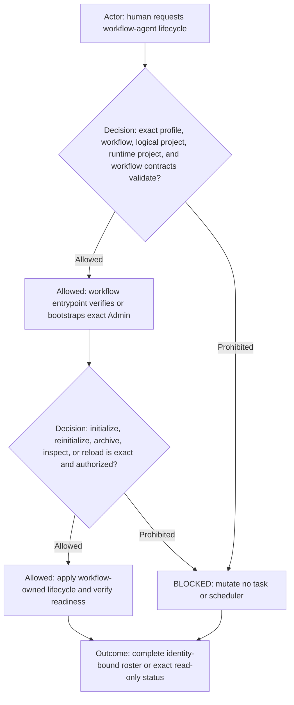
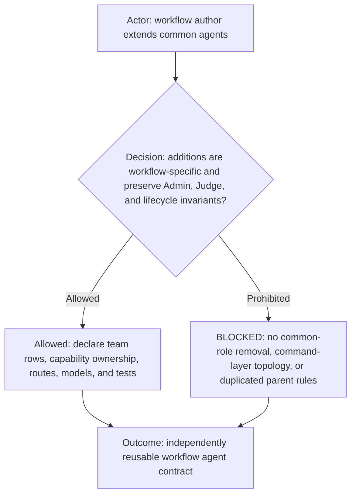

# Common workflow agents

**DIAGRAM-FIRST CONTRACT — NO UNCOVERED RULE TEXT.** Every normative chapter starts with a compact vertical Mermaid
diagram containing its actor, prerequisite or decision, allowed route, prohibited or `BLOCKED` route, and terminal
outcome. Diagram/text mismatch is `BLOCKED`.

This is the common agent-layer contract for every workflow that activates managed AI agents. It extends the portable
[`agents.command.md`](../ai-commands/agents/agents.command.md) behavioral vocabulary without turning workflow topology into an AI command.
Each workflow entrypoint and team manifest link this file and add only their workflow-specific roles, capabilities,
communication routes, models, reasoning, and lifecycle deltas.

## Common workflow-agent composition

The portable Agents command defines generic identity, capability, packet, delivery, interruption, and delegation
invariants. This file defines the shared topology and lifecycle required by agent-enabled workflows. The selected
workflow defines its exact team and operational behavior. A workflow must reference both parent layers; copying either
parent into a workflow-specific file is prohibited because it creates divergent sources of truth.

## Common Admin and Judge roles

Every agent-enabled workflow declares exactly one persistent human-facing `Admin` infrastructure task. It also declares
exactly one persistent human-facing `Judge` oversight role. Display labels are `🔑 Admin` and `⚖️ Judge` unless the workflow documents
a human-approved presentation-only variation; canonical identities remain `admin` and `judge`.

Admin owns only workflow information and exact agent lifecycle administration. It remains outside the governed team and
every capability matrix, is never an operational relay or product worker, and is preserved during governed-roster
reinitialization. Judge belongs to the governed roster, owns that workflow's protected rules and compliance oversight,
and remains subject to the workflow's human-approval, communication-firewall, validation, and publication gates. A
workflow may narrow these roles but must not transfer their common ownership to another role.

## Common initialization lifecycle

The workflow-owned initialization entrypoint—not the portable Agents command—verifies or bootstraps Admin and performs
all task mutation. Initialization creates the complete declared governed roster. Reinitialization preserves Admin,
reconciles roster-owned schedules, archives the complete old roster, verifies an inactive barrier, creates one fresh
complete roster, binds app-returned task IDs, and verifies every readiness token. Archive/remove/delete are recoverable
archive operations unless the workflow explicitly defines a safer alternative. Partial generations, implicit profile
selection, title-only identity, hidden substitutes, and cross-project reuse are `BLOCKED`.

## Workflow extension boundary

Each workflow declares its additional roles and exact team size in its own `agents/team.md`; only Judge appears in that
governed-team table from the common pair. The workflow supplies `agents/admin.md`, `agents/judge.md`, its initializer,
initialization contract, capability data, communication topology, focused tests, and any schedules. Models and reasoning
remain workflow-configurable. A workflow without managed agents does not load this contract, but it must load it before
introducing any agent role or lifecycle behavior.
