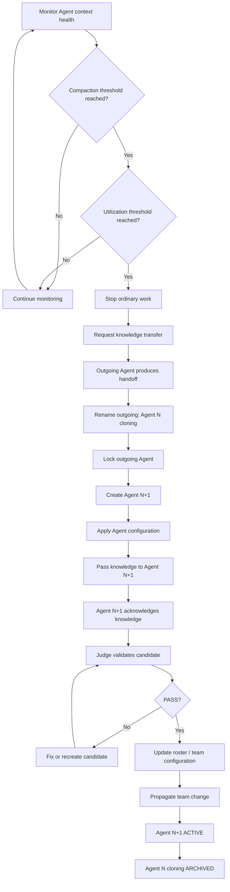

# Role Specification

This document defines the common contract for reusable roles.

A role is a reusable responsibility/behavior definition. A runtime agent is an implementation/instance of a role inside a particular workflow/profile.

## Human-facing `why.md`

Every reusable role MUST have a companion human-facing `why.md` explanation.

`role definition = what it is / what it must do`

`why.md = why we introduced it / what problem it solves`

## Required role properties

Every role definition MUST contain Properties with at least `level`, `human-facing`, `interaction-mode`, `memory-class`, and `lifecycle`.

## Agent instantiation contract

A role definition is not yet a runtime agent. Instantiating a role as an agent requires the workflow/profile/runtime to fill required runtime parameters and bindings.

Every runtime AI agent MUST have, at minimum:

- concrete runtime identity/team slot;
- workflow/source binding;
- role binding;
- model/intelligence/reasoning/context configuration;
- memory and lifecycle configuration;
- scheduling configuration;
- capability implementation bindings;
- Team communication/command/lifecycle authorization;
- clone policy with `clone-after-compactions` and `clone-at-context-utilization` thresholds.

When both configured context-health signals are available, proactive cloning requires both thresholds:

`compaction/equivalent count >= clone-after-compactions`

**AND**

`context utilization/pressure >= clone-at-context-utilization`

If a harness cannot expose one configured signal, runtime MAY use an explicitly configured harness-specific equivalent policy, but MUST NOT invent context-health data. The objective remains replacement while reliable knowledge transfer is still possible.

An agent with unresolved required instantiation parameters is **NOT READY** and MUST NOT enter normal active workflow operation.

## Initialization validation

Before normal activation, candidate configuration MUST be validated against applicable Role, Workflow and Team rules. When a Judge exists, lifecycle/staffing authority presents candidate facts through the bounded initialization-validation path.

`lifecycle authority creates candidate -> Judge validates -> PASS -> roster/team activation`

`FAIL -> NOT READY -> fix/recreate -> validate again`

## Role capabilities versus concrete commands

Reusable Roles describe conceptual capabilities, never concrete AI Command dependencies. Concrete binding belongs to workflow Agent realization:

`Role capability -> Agent binding -> Team command authorization -> Command/provider/harness`

## Prompt / intent scenarios

Every role MUST contain a prompt/intent scenario table, even when empty.

| Example prompt / intent | Role interpretation | Workflow routing required |
| --- | --- | --- |
|  |  |  |

## Inherited agent communication and trust

Every runtime agent inherits [`_common/communication.md`](_common/communication.md).

## Team/runtime separation

Reusable roles do not own concrete team membership. Workflow defines static Team contract; runtime maintains dynamic roster mapping concrete IDs to team slots/instances.

## Runtime Agent generation naming

Each configured Agent has a stable **base name** and runtime instances use a monotonically increasing generation number in parentheses:

`<Agent base name> (<generation>)`

Examples:

`Coder (1)`

`Coder (2)`

`Designer Reviewer (3)`

The first runtime instance starts at generation `1`. Every replacement/cloning operation for that Agent increments the generation by exactly one. Generation numbers MUST NOT be reused or decremented within the active workflow/session lineage.

The generation makes replacement history visible: `Coder (4)` means the current Coder lineage is on its fourth runtime instance, so three prior replacements occurred in that lineage.

The generation belongs to the runtime instance, not to the reusable Role or Agent base name.

### Outgoing cloning marker

The `(cloning)` marker is applied **only to the outgoing/old instance**, never to the newly created replacement.

If the current instance is:

`Coder (1)`

then during replacement the visible transition is:

`Coder (1)` -> `Coder (1) (cloning)`

while the replacement appears as:

`Coder (2)`

During the handover both may temporarily be visible, but they have different lifecycle states:

`Coder (1) (cloning)` = outgoing, locked, not allowed to perform ordinary work

`Coder (2)` = incoming candidate/ready instance; becomes ACTIVE only after required initialization/knowledge-transfer validation

After successful activation of `Coder (2)`, `Coder (1) (cloning)` is archived/dismissed from the active roster.

Conceptually:

`Coder (1) ACTIVE -> Coder (1) (cloning) LOCKED + Coder (2) candidate -> Coder (2) ACTIVE -> Coder (1) archived`

## Knowledge transfer

**Knowledge transfer** is the deliberate handoff of task-relevant working knowledge from an outgoing Agent to its replacement before the outgoing Agent loses reliable access to that knowledge.

The transfer SHOULD preserve current objective/responsibility, important decisions/reasons, completed work, current state/evidence, unresolved questions/blockers, assumptions/constraints and next intended action.

It is not normally a raw transcript dump. The outgoing Agent produces a compact task-relevant handoff while still capable of accurately describing its working state. Lifecycle authority transports the handoff to the replacement. The replacement MUST acknowledge/incorporate the supplied knowledge before it is considered ready to continue the responsibility.

## Common clone lifecycle

Every runtime AI Agent MUST understand that its instance may be cloned/replaced. Which participant may initiate cloning is determined by authoritative Team lifecycle policy.

### Proactive cloning

Proactive cloning is the normal path and occurs before context exhaustion.

The critical invariant is:

`knowledge transfer MUST happen before the outgoing instance enters (cloning) lock and before context exhaustion`

### Recovery cloning after context loss

Recovery cloning is the degraded/emergency path when proactive replacement was missed and the Agent can no longer produce trustworthy knowledge transfer.

`context lost -> stop/lock exhausted Agent -> create next generation -> reconstruct best available context -> validate -> activate -> archive old Agent`

Reconstruction may use workflow artifacts, task/ticket state, source control, runtime evidence, durable memory or knowledge held by supervising/coordinating participants. These are recovery mechanisms, not normal knowledge transfer.

### Clone signal behavior

An Agent receiving a clone/replace signal MUST validate sender authority against authoritative Team lifecycle policy. Unauthorized requests are refused.

If authorized and reliable context remains, the outgoing Agent stops ordinary work, produces knowledge transfer, and only then is marked `(cloning)` and locked.

While `(cloning)`:

- no domain/task work is allowed;
- no new work may be accepted;
- no flow may be started/resumed;
- no ordinary commands/tools or mutations are allowed;
- ordinary Agent communication is refused;
- only minimal authorized lifecycle/protocol communication is permitted.

The outgoing Agent does not create its replacement, transport its handoff, update roster, notify team or archive itself unless workflow policy explicitly grants such lifecycle authority.

## Command authority — not granted by default

Concrete commands are never granted at reusable Role level. Workflow implementation binds capabilities and grants commands through Team policy.

## Human participant

Every workflow starts from or ultimately serves Human. Human is not an AI agent but MUST be represented in workflow Team communication/capability modeling when interaction exists.

## Human-facing semantics

`human-facing` is a default characteristic and may be explicitly overridden by workflow/profile.

## Interaction mode

- `reactive` — acts when invoked/routed.
- `proactive` — may initiate work/communication when mandate/runtime allow it.
- `mixed` — supports both.

Interaction mode does not grant authority.

## Override rule

Reusable role properties are defaults. Workflow/profile specialization may override explicitly but SHOULD NOT silently broaden authority, privacy access, command permissions or memory scope.

## Acceptance checklist

- [ ] Purpose/responsibility is defined.
- [ ] Required Properties are declared.
- [ ] Companion human-facing `why.md` exists.
- [ ] Prompt/intent scenario table exists.
- [ ] Role describes conceptual capabilities rather than concrete AI Commands.
- [ ] Runtime Agent generation follows `<base name> (<generation>)` and increments on replacement.
- [ ] `(cloning)` is applied only to the outgoing instance.
- [ ] Runtime Agent inherits proactive/recovery clone lifecycle and validates cloning authority.
- [ ] Both configured context-health thresholds gate normal proactive cloning when both signals are available.
- [ ] Knowledge transfer completes before outgoing `(cloning)` lock when reliable context remains.
- [ ] Replacement acknowledges transferred knowledge before ACTIVE.
- [ ] Initialization is validated before normal roster/team activation.
- [ ] Team command matrix remains authoritative for command permission.